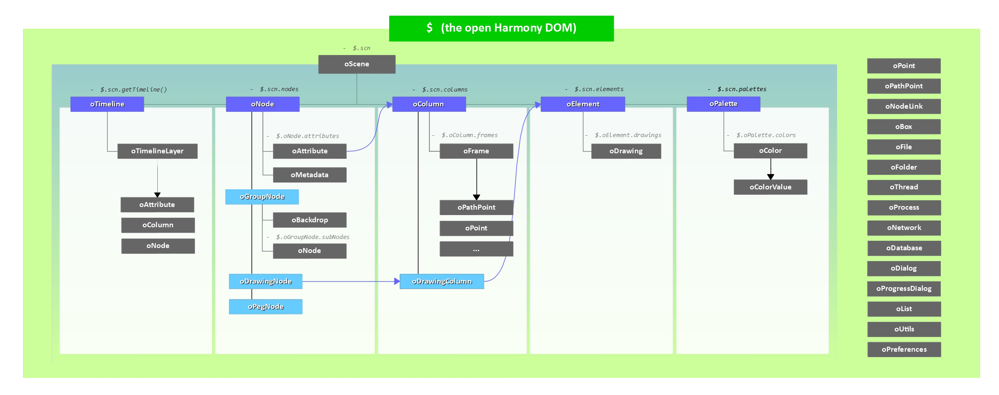

# OpenHarmony - The Toonboom Harmony Open Source DOM Library

## Why did we make this library ?

Ever tried to make a simple script for toonboom Harmony, then got stumped by the numerous amount of steps required to execute the simplest action? Or bored of coding the same helper routines again and again for every studio you work for?

Toonboom Harmony is a very powerful software, with hundreds of functions and tools, and it unlocks a great amount of possibilities for animation studios around the globe. And... being the produce of the hard work of a small team forced to prioritise, it can also be a bit rustic at times!

We are users at heart, animators and riggers, who just want to interact with the software as simply as possible. Simplicity is at the heart of the design of openHarmony. But we also are developpers, and we made the library for people like us who can't resist tweaking the software and bend it in all possible ways, and are looking for powerful functions to help them do it.

This library's aim is to create a more direct way to interact with Toonboom through scripts, by providing a more intuitive way to access its elements, and help with the cumbersome and repetitive tasks as well as help unlock untapped potential in its many available systems. So we can go from having to do things like this:

```javascript
  // adding a Drawing to the scene with the official API
  var myNodeName = "Drawing";
  var myColumnName = myNodeName;
  var myNode = node.add("Top", myNodeName, "READ",0,0,0);
  var myColumn = column.add(myColumnName, "DRAWING", "BOTTOM");
  var myElement = element.add (myNodeName, "COLOR", 12, "SCAN", "TVG");
  column.setElementIdOfDrawing(myColumnName, myElement);
  node.linkAttr (myNode, "DRAWING.ELEMENT", myColumnName);
  drawing.create (myElement, "1", false, false);
  column.setEntry (myColumnName, 0, 1, "1");
```

to simply writing : 

```javascript
  // with openHarmony
  var myNode = $.scene.root.addDrawingNode("Drawing");
  myNode.element.addDrawing(1);
```

Less time spent coding, more time spent having ideas!

-----
## The OpenHarmony Document Object Model or DOM

OpenHarmony is based around the four principles of Object Oriented Programming: *Abstraction*, *Encapsulation*, *Inheritance*, *Polymorphism*.

This means every element of the Harmony scene has a corresponding abstraction existing in the code as a class. We have oNode, oScene, oColumn, etc. Unlike in the official API, each class creates objects that are instances of these classes and encapsulate them and all their actions. It means no more storing the path of nodes, column abstract names and element ids to interact with them; if you can create or call it, you can access all of its functionalities. Nodes are declined as DrawingNodes and PegNodes, which inherint from the Node Class, and so on.



The *Document Object Model* is a way to organise the elements of the Toonboom scene by highlighting the way they interact with each other. The Scene object has a root group, which contains Nodes, which have Attributes which can be linked to Columns which contain Frames, etc. This way it's always easy to find and access the content you are looking for. The attribute system has also been streamlined and you can now set values of node properties with a simple attribution synthax. 

We implemented a global access to all elements and functions through the standard **dot notation** for the hierarchy, for ease of use, and clarity of code.

Functions and methods also make extensive use of **optional parameters** so no more need to fill in all arguments when calling functions when the default behavior is all that's needed.

On the other hand, the "o" naming scheme allows us to retain full access to the official API at all times. This means you can use it only when it really makes your life better.

-----
## Adopting openHarmony for your project

This library is made available under the [Mozilla Public license 2.0](https://www.mozilla.org/en-US/MPL/2.0/).

OpenHarmony can be downloaded from [this repository](https://github.com/cfourney/OpenHarmony/) directly. In order to make use of its functions, it needs to be unzipped next to the scripts you will be writing. 

All you have to do is call :
```javascript
include("openHarmony.js");
```
at the beggining of your script.

You can ask your users to download their copy of the library and store it alongside, or bundle it as you wish as long as you include the license file provided on this repository.

The entire library is documented at the address : 

https://cfourney.github.io/OpenHarmony/$.html

This include a list of all the available functions as well as examples and references (such as the list of all available node attributes).

As time goes by, more functions will be added and the documentation will also get richer as more examples get created.

-----
## Installation

To install, download a copy of the files from the repository from Github, then unzip the contents anywhere, and run `install.bat`. This will prompt you to ask which installation of Harmony you want to use with it. 

This will copy the files into the user's script folder where scripts can make direct use of it.

In the future, we have plans to allow storage of the files in any folder on the computer or remote server through an environment variable.

-----
## Contributing to openHarmony

This library was created by Mathieu Chaptel and Chris Fourney.

If you're using openHarmony, and are noticing things that you would like to see in the library, please feel free to contribute to the code directly, or send us feedback through Github. This project will only be as good as people working together can make it, and we need every piece of code and feedback we can get, and would love to hear from you!